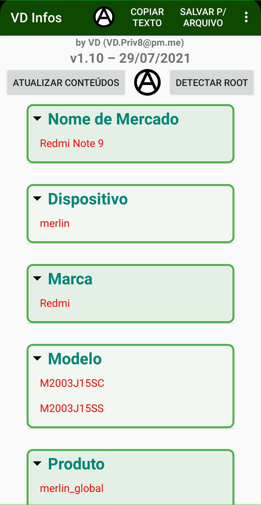
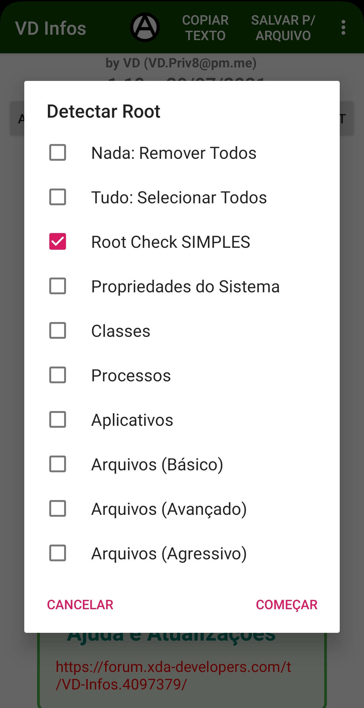

[English](README.md) | **Português**  
  
# VD-Infos  
Tópico no XDA: https://xdaforums.com/t/app-vd-infos-package-com-vitaodoidao-vdinfos.4097379/  
  
   
  
Como todos já sabemos, o Android é um sistema operacional super potente e super versátil.  
O que ninguém conta para você, é que todos os seus detalhes pessoais e informações confidenciais, estão disponíveis para todos os seus aplicativos instalados.  
Se proteger destes tipos de invasões de privacidade, é uma obrigação.  
O app VD Infos lê vários destes detalhes e informações para expor para você um exemplo do que pode ser capturado do seu aparelho em uso.  
**NENHUMA INFORMAÇÃO É ARMAZENADA, ENVIADA OU TRANSMITIDA PARA NENHUM ARQUIVO OU SERVIDOR**  
Se quiser, você pode desautorizar o uso da internet com um firewall, ou você pode simplesmente desligar a internet.  
  
  
  
## **Por que usar?**  
* **Apenas por curiosidade.**  
* **Ver as informações do dispositivo.**  
* **Testar seus hooks e camuflagens.**  
  
## **Línguas:**  
* **Inglês**  
* **Português**  
  
## **O que ele pode ler ?**  
* **ULTRA ROOT DETECTOR** (superusuário).  
* **ULTRA MAGISK DETECTOR**.  
* **ULTRA XPOSED DETECTOR**.  
* **ULTRA RIRU DETECTOR**.  
* Root Check simples (rápido e prático).  
* Checa várias maneiras para detectar emuladores android.  
* Checa várias maneiras para detectar o busybox, whale framework, taichi frameworks, xposedbridge, edxposed, virtualxposed, vaexposed, lsposed, exposed, quickxposed, sandvxposed, zhihuxposed, xhook, supersu, suhide, luckypatcher, deviceemulator, rootcloak, xprivacy, xprivacylua, ebxprivacy, titaniumbackup, deviceidmasker e outros.  
* Lê o Bluetooth MAC e NOME VISÍVEL.  
* Lê dispositivos bluetooth pareados.  
* Lê a versão do rádio/modem/baseband.  
* Lê o estado do BOOTLOADER.  
* Lê o nome do aparelho.  
* Lê os dados do aparelho: Nome de Mercado, Dispositivo, Marca, Modelo, Produto, Display ID, Fabricante, Hardware.  
* Lê os dados do Android: Host, Tipo, Data do Sistema e Versão do Android.  
* Lê os dados do Sistema: KERNEL, MEMÓRIA, Atualização de Segurança e Versão do Sistema.  
* Lê os dados da encriptação.  
* Lê as chaves da build.  
* Lê a REGIÃO.  
* Lê o Advertising ID.  
* Detecta a configuração atual do Selinux.  
* Lê as propriedades da build.  
* Lê o Android ID.  
* Lê o GSF ID (Google Sevices Framework).  
* Lê o IMEI (de todos os chips).  
* Lê a IMPRESSÃO DIGITAL de vários métodos.  
* Checa várias maneiras para ler o número SERIAL.  
* Lista as CONTAS.  
* Lista o HISTÓRICO DE LIGAÇÕES.  
* Lê o User-Agent (http.agent e getUserAgentString).  
* Lista as informações do CHIP (de todos os chips).  
* Lista as informações do TELEFONE.  
* Lista as informações do WIFI (como MAC, IP, NOME, DNS, DHCP e redes WIFI conectadas anteriormente).  
* Lista as informações das REDES (cada uma).  
* Lista os PROCESSOS EM EXECUÇÃO.  
* Lista os SERVIÇOS EM EXECUÇÃO.  
* Lista os PACOTES INSTALADOS.  
* Lista os APLICATIVOS INSTALADOS.  
  
## **Como se proteger ?**  
* **Blank's Integrity Guide:** Um guia sobre como esconder o root e passar o Strong Integrity.  
https://t.me/BlankAssistance/7/2437  
https://t.me/BlankAssistance  
https://t.me/BlankAssistance_Integrity  
* **Magisk:** Um conjunto de código aberto para personalizar o Android, suportando dispositivos a partir do Android 6.0.  
https://github.com/topjohnwu/Magisk  
https://xdaforums.com/t/magisk-the-magic-mask-for-android.3473445/  
* **Magisk Alpha:** Um fork do Magisk.  
https://t.me/magiskalpha  
* **Kitsune Mask (Magisk Delta):** Um fork do Magisk.  
https://github.com/KitsuneMagisk/Magisk  
https://github.com/HuskyDG/magisk-files  
https://xdaforums.com/t/discussion-kitsune-mask-another-unofficial-mask-of-magisk.4460555/  
* **APatch:** O patcher do kernel Android e do sistema Android.  
https://github.com/bmax121/APatch  
https://xdaforums.com/t/dev-apatch-an-alternative-root-solution-to-kernelsu-and-magisk.4655727/  
* **KernelSU:** Uma solução root baseada no kernel para dispositivos Android.  
https://github.com/tiann/KernelSU  
* **LSPosed:** Sucessor do Xposed Framework.  
https://xdaforums.com/t/lsposed-xposed-framework-8-1-13-0-simple-magisk-module.4228973/  
https://github.com/LSPosed/LSPosed  
https://t.me/LSPosed  
https://t.me/LSPosedDiscussion  
https://t.me/LSPosedArchives  
https://t.me/lsposed_log  
* **LSPosed Internal:** Um fork do LSPosed de seus próprios desenvolvedores.  
https://t.me/+VoX7SSzR6UUyN2I1  
* **LSPosed Irena:** Um fork do LSPosed.  
https://github.com/re-zero001/LSPosed-Irena  
* **LSPosed NPM:** Um fork do LSPosed.  
https://t.me/rormzhstjxm  
* **LSPosed by JingMatrix:** Um fork do LSPosed.  
https://github.com/JingMatrix/LSPosed  
* **LSPosed_mod by mywalkb:** Um fork do LSPosed.  
https://github.com/mywalkb/LSPosed_mod  
* **LSPosed by CMDQ8575:** Um fork do LSPosed.  
https://github.com/CMDQ8575/LSPosed  
* **XPL-EX (XPrivacyLua Extended):** Um fork do XPrivacyLua.  
https://xdaforums.com/t/xpl-ex-xprivacylua-ex-android-privacy-manager-hooking-manager-extended.4652573/  
https://github.com/0bbedCode/XPL-EX  
https://t.me/XPL_EX  
https://t.me/XPL_EX_CHAT  
* **XPL-EX Pro (XPrivacyLua Extended Pro):** Um fork do XPrivacyLuaPro.  
https://github.com/0bbedCode/XPL-EX/releases  
* **WeiJu2:** O primeiro módulo xposed programável, fornece uma nova maneira de alterar o comportamento dos aplicativos. Movido pelo Lua e feito com ♥  
https://xdaforums.com/t/app-xposed-7-0-weiju2-scriptable-xposed-module.4482585/  
https://github.com/ikws4/WeiJu2  
* **Shamiko:** Um módulo Zygisk para esconder o root, o Magisk, o próprio Zygisk e outros módulos Zygisk.  
https://github.com/LSPosed/LSPosed.github.io/releases  
* **Zygisk-Assistant:** Um módulo Zygisk para ocultar o root para Kernelsu, Magisk e Apatch, projetado para funcionar no Android 5.0 e acima.  
https://github.com/snake-4/Zygisk-Assistant  
https://xdaforums.com/t/module-zygisk-assistant-foss-root-hider.4664761/  
* **Cherish Peekaboo:** Um tipo de alternativa do Shamiko para o APatch.  
https://t.me/app_process64  
* **Sensitive Props mod:** Reseta propriedades sensíveis para um estado seguro.  
https://www.pling.com/p/2129780  
https://github.com/Pixel-Props/sensitive-props  
https://t.me/PixelProps  
https://t.me/pixelpropschat  
* **Zygisk-maphide:** Limpe os traços de arquivos montados dos módulos do Magisk para processo na Lista de Negação.  
https://github.com/HuskyDG/zygisk-maphide  
* **ZygiskNext:** Implementação independente do Zygisk, fornecendo suporte à API do Zygisk para KernelSU e uma substituição do Zygisk integrado do Magisk.  
https://github.com/Dr-TSNG/ZygiskNext  
https://t.me/real5ec1cff  
https://t.me/nullptr_dev  
* **Zygisk_mod:** Um fork de código aberto do Zygisk Next.  
https://github.com/Admirepowered/Zygisk_mod  
* **ReZygisk:** Um fork do Zygisk Next, que é uma implementação independente de Zygisk fornecendo suporte à API de Zygisk para KernelSU, Magisk (além de embutido) e Apatch (trabalho em progresso).  
https://github.com/PerformanC/ReZygisk  
* **Tricky Store:** Um truque keystore.  
https://github.com/5ec1cff/TrickyStore  
https://xdaforums.com/t/tricky-store-the-next-generation-pif.4683446/  
https://t.me/real5ec1cff  
https://t.me/nullptr_dev  
* **TrickyStore by N-X-T:** Um fork do TrickyStore.  
https://github.com/N-X-T/TrickyStore  
* **TrickyStore by tryigit:** Um fork do TrickyStore.  
https://github.com/tryigit/TrickyStore  
* **Zygisk-KeystoreInjection:** Gere uma cadeia de certificados válidos do zero, injetando o provedor de keystore personalizado.  
https://github.com/aviraxp/Zygisk-KeystoreInjection  
* **PlayIntegrityFix:** Um módulo que tenta corrigir o Play Integrity e o SafetyNet para obter um atestado válido.  
https://github.com/chiteroman/PlayIntegrityFix  
https://xdaforums.com/t/module-play-integrity-fix-safetynet-fix.4607985/  
https://t.me/playintegrityfix  
https://t.me/playintegrityfixchat  
* **PlayIntegrityFork:** Um fork do PlayIntegrityFix, para ser mais à prova de futuro e desenvolver mais metodicamente.  
https://github.com/osm0sis/PlayIntegrityFork  
* **PlayIntegrityFix by tryigit:** Um fork do PlayIntegrityFix.  
https://github.com/tryigit/PlayIntegrityFix  
* **PlayIntegrityNEXT:** Um módulo que baixa uma impressão digital em vez de fazer um fork toda vez. O módulo é chamado de 'PlayCurl' e você simplesmente precisa instalá-lo junto ao PlayIntegrityFix oficial.  
https://github.com/daboynb/PlayIntegrityNEXT  
* **AutoPIF Next - PlayIntegrity Fix Next Fork:** Faz o download online automaticamente de um PIF.json funcionando do repositório e camufla o Google Play Integrity Check.  
https://xdaforums.com/t/module-autopif-next-play-integrity-fix-fork-safetynet-fix.4652252/  
https://github.com/x1337cn/AutoPIF-Next  
* **playcurlNEXT:** Baixa automaticamente fingerprints para o play integrity fix.  
https://github.com/daboynb/playcurlNEXT  
* **Framework Patch:** Modifica o Framework.jar para construir uma cadeia de certificados válidos a nível do sistema.  
https://github.com/chiteroman/FrameworkPatch  
* **Framework Patcher GO:** Um módulo Magisk/KernelSU/APatch para modificar o framework.jar diretamente no aparelho, para criar uma cadeia de certificação válida a nível do sistema.  
https://github.com/changhuapeng/FrameworkPatcherGO  
https://xdaforums.com/t/module-framework-patcher-go.4674536/  
* **Hide My AppList:** Um módulo do Xposed para esconder apps ou rejeitas solicitações de listas de apps.  
https://github.com/Dr-TSNG/Hide-My-Applist  
* **HMAL:** Um fork do Hide My AppList.  
https://github.com/pumPCin/HMAL  
* **Geergit:** Um Módulo Para Proteger Sua Privacidade.  
https://xdaforums.com/t/app-xposed-5-0-13-geergit-a-module-to-protect-your-privacy.4573243/  
https://github.com/pyshivam/geergit-discussion  
https://github.com/Xposed-Modules-Repo/com.pyshivam.geergit  
https://t.me/geergit_xposed  
* **Android Faker:** Um Módulo Para Camuflar Seu Aparelho.  
https://xdaforums.com/t/app-xposed-8-1-13-android-faker-a-module-for-spoof-your-device.4284233  
https://github.com/Android1500/AndroidFaker  
https://github.com/Xposed-Modules-Repo/com.android1500.androidfaker  
https://t.me/androidfakerofficial  
* **Device ID Masker:** Camufle suas informações privadas vitais de aplicativos de terceiros e de sistema.  
https://bytesreverserapps.com/device-id-masker/  
* **I am not a developer:** Esconde o modo desenvolvedor, modo de depuração via USB e modo de depuração via wifi.  
https://github.com/xfqwdsj/IAmNotADeveloper  
https://github.com/Xposed-Modules-Repo/xyz.xfqlittlefan.notdeveloper  
* **E-Government Liberator (formalmente Digitales Amt Liberator):** O E-Government Liberator remove quaisquer chamadas em apps do governo austríaco suportados para verificações de root e bootloader, portanto, fornece uma solução personalizada para executar o app em dispositivos com root.  
https://github.com/Crazyphil/digitales-amt-liberator  
* **BootloaderSpoofer:** Camufle o bootloader desbloqueado em atestados locais.  
https://github.com/chiteroman/BootloaderSpoofer  
https://xdaforums.com/t/spoof-locked-bootloader-bypass-tee-check.4586251/  
* **Wa Revamp:** Um módulo do Xposed para personalizar e habilitar privacidade no WhatsApp..  
https://github.com/ItsMadruga/WaRevamp  
https://t.me/warevampmodule  
* **Wa Enhancer:** Um módulo do Xposed para personalizar e habilitar privacidade no WhatsApp.  
https://t.me/waenhancer  
https://t.me/waenhancher  
https://github.com/Dev4Mod/WaEnhancer  
* **AdClose:** Um módulo do Xposed para prevenir propagandas comerciais dentro do app. Bloquear solicitações de propagandas comerciais. Permitir capturas e gravções de tela livremente. Remover deteção de VPN e proxy. Desativar propagandas comerciais basedas em sensores. Remover deteção geral do Root, Magisk e do Xposed.  
https://github.com/Xposed-Modules-Repo/com.close.hook.ads  
https://github.com/zjyzip/AdClose  
* **NoVPNDetect:** Um módulo do Xposed para prevenir que apps possam detectar que o aparelho está conectado em uma VPN.  
https://github.com/Xposed-Modules-Repo/me.hoshino.novpndetect  
https://bitbucket.org/yuri-project/novpndetect  
* **NeoBackup:** Um moderno gerenciador de backup para o Android.  
https://github.com/NeoApplications/Neo-Backup  
https://t.me/neo_backup  
https://xdaforums.com/t/app-8-0-open-source-root-neo-backup-apps-and-data-backup-tool-for-android.4167179/  
* (Obsoleto) **XPrivacyLua:** Sucessor do XPrivacy. Negar o uso de permissões para os aplicativos, geralmente faz os aplicativos travarem ou apresentarem mau funcionamento. O XPrivacyLua resolve isso alimentando os aplicativos com dados falsos em vez de dados reais.  
https://xdaforums.com/t/discussion-lsposed-unofficial-xprivacylua-android-privacy-manager.4533999/  
https://xdaforums.com/t/closed-app-xposed-6-0-xprivacylua-android-privacy-manager-unsupported.3730663/  
https://github.com/Xposed-Modules-Repo/eu.faircode.xlua  
* (Obsoleto) **XPrivacyLuaPro:** Versão PRO para o XPrivacyLua.  
https://xdaforums.com/t/closed-app-xposed-6-0-xprivacylua-pro-companion-app.3743040/  
https://bitbucket.org/M66B/xlua-companion/downloads/  
* (Obsoleto) **Magisk Hide:** Bloqueia nativamente o uso e detecção do root (superusuário).  
https://xdaforums.com/apps/magisk/official-magisk-v7-universal-systemless-t3473445  
https://github.com/topjohnwu/Magisk  
* (Obsoleto) **Riru - Enhanced mode for Magisk Hide:** Ativa o modo aprimorado para o Magisk Hide. Permite que o Magisk Hide possa lidar com processos isolados.  
https://github.com/vvb2060/riru-unshare  
* (Obsoleto) **Riru - Momo Hider:** Este módulo tenta deixar o "Magisk Hide" mais escondido.  
https://github.com/canyie/Riru-MomoHider  
* (Obsoleto) **Universal SafetyNet Fix:** Módulo Magisk para trabalhar em torno do SafetyNet do Google e reproduzir o atestado do Play Integrity.  
https://xdaforums.com/t/magisk-module-universal-safetynet-fix-2-4-0.4217823/  
https://github.com/kdrag0n/safetynet-fix  
* (Obsoleto) **RootCloak2:** Bloqueia o uso e detecção do root (superusuário), além de também bloquear o uso de outros comandos que podem ser personalizados.  
https://xdaforums.com/t/mod-xposed-4-0-rootcloak-completely-hide-root-from-specific-apps-2014-01-14.2574647/  
https://mattj.io/rootcloak/  
https://github.com/devadvance/rootcloak  
* (Obsoleto) **Device Emulator:** Módulo Xposed para mudar (MASCARAR) as várias identificações no telefone.  
https://deviceemulator.github.io/app  
* (Obsoleto) **XPrivacy:** Impede que aplicativos vazem dados confidenciais, restringindo as categorias de dados que um aplicativo pode acessar. O XPrivacy alimenta os aplicativos com dados falsos ou dados nenhum.  
https://xdaforums.com/t/closed-xprivacy-the-ultimate-yet-easy-to-use-privacy-manager.2320783/  
https://github.com/M66B/XPrivacy  
* (Obsoleto) **Xposed:** O Xposed é uma estrutura que permite aos desenvolvedores aplicar módulos à memória somente leitura (Read-Only Memory) (ROM) do Android com o objetivo de modificar o comportamento do app ou criar um app modificado.  
https://xdaforums.com/t/official-xposed-for-lollipop-marshmallow-nougat-oreo-v90-beta3-2018-01-29.3034811/  
https://xdaforums.com/t/xposed-general-info-versions-changelog.2714053/  
https://github.com/rovo89?tab=repositories&q=xposed  
* (Obsoleto) **Mdg Wa:** Um módulo do Xposed para personalizar e habilitar privacidade no WhatsApp.  
https://github.com/ItsMadruga/MdgWa  
  
## **Baseado em:**  
* **RootBeer Sample:** https://github.com/scottyab/rootbeer  
* **RootbeerFresh:** https://github.com/kimchangyoun/rootbeerFresh  
* **Native Root Checker:** https://github.com/DimaKoz/meat-grinder  
* **PiracyChecker** https://github.com/javiersantos/PiracyChecker  
* **Cordova Jailbreak/Root Detection Plugin** https://github.com/WuglyakBolgoink/cordova-plugin-iroot  
  
## **Testado em:**  
* **Android 4.4.2:** SDK 19  
* **Android 4.4.4:** SDK 19  
* **Android 5.0.2:** SDK 21  
* **Android 5.1.1:** SDK 22  
* **Android 6.0:** SDK 23  
* **Android 7.0:** SDK 24  
* **Android 7.1.1:** SDK 25  
* **Android 7.1.2:** SDK 25  
* **Android 8.0.0:** SDK 26  
* **Android 8.1.0:** SDK 27  
* **Android 9.0:** SDK 28  
* **Android 10.0:** SDK 29  
* **Android 11.0:** SDK 30  
* **Android 12.0:** SDK 31  
  
## **Como detectar o root ?**  
Use detectores nativos. Como:  
  
* **Holmes:** https://t.me/app_process64  
* **Native Test:** https://t.me/nullptr_dev  
* **Native Detector:** https://t.me/reveny1  
* **Hunter:** https://t.me/Zhenxi233  
* **Momo:** https://t.me/magiskalpha  
* **Securify:** https://github.com/RabehX/Securify/releases  
* **Memory Detector:** https://github.com/reveny/detection/blob/main/MemoryDetector_2.1.0.apk  
* **Env Checks:** https://play.google.com/store/apps/details?id=com.dexprotector.detector.envchecks  
  
## **Contatos:**  
* **Skype:** VD.Priv8  
* **Telegram:** VD_Priv8  
* **E-mail:** vd.priv8 @ pm.me  
* **XDA-Developers:** VD171 https://xdaforums.com/m/vd171.4699873/  
  
## **Licença:**  
* Use e distribua da maneira que quiser e como você bem entender.  
  
## **Agradecimentos:**  
* **AkaBlank517:** https://t.me/AkaBlank517  
* **rovo89:** https://xdaforums.com/m/rovo89.4419114/  
* **rovo89:** https://github.com/rovo89  
* **re-zero001:** https://github.com/re-zero001  
* **pumPCin:** https://github.com/pumPCin  
* **mywalkb:** https://github.com/mywalkb  
* **CMDQ8575:** https://github.com/CMDQ8575  
* **ObbedCode:** https://xdaforums.com/m/obbedcode.12793605/  
* **ObbedCode:** https://github.com/0bbedCode  
* **zhipingne:** https://xdaforums.com/m/zhipingne.9027367/  
* **ikws4:** https://github.com/ikws4  
* **M66B:** https://xdaforums.com/m/m66b.2799345/  
* **M66B:** https://github.com/M66B  
* **Fif_:** https://xdaforums.com/m/fif_.5297163/  
* **Fif_:** https://github.com/F-i-f  
* **AndroidX:** https://xdaforums.com/m/androidx.7762470/  
* **AndroidX:** https://github.com/Android1500  
* **Unique Solution:** https://deviceemulator.github.io/app  
* **BytesReverser:** https://xdaforums.com/m/bytesreverser.8062804/  
* **pyshivam:** https://xdaforums.com/m/pyshivam.9833141/  
* **pyshivam:** https://github.com/pyshivam  
* **scottyab:** https://xdaforums.com/m/scottyab.2530687/  
* **scottyab:** https://github.com/scottyab  
* **topjohnwu:** https://xdaforums.com/m/topjohnwu.4470081/  
* **topjohnwu:** https://github.com/topjohnwu  
* **devadvance:** https://xdaforums.com/m/devadvance.2804938/  
* **devadvance:** https://github.com/devadvance  
* **hikaritenchi:** https://xdaforums.com/m/hikaritenchi.3514987/  
* **hikaritenchi:** https://github.com/hikaritenchi  
* **DimaKoz** https://github.com/DimaKoz  
* **kimchangyoun** https://github.com/KimChangYoun  
* **javiersantos** https://github.com/javiersantos  
* **WuglyakBolgoink** https://github.com/WuglyakBolgoink  
* **vvb2060:** https://github.com/vvb2060  
* **canyie:** https://github.com/canyie  
* **yujincheng08:** https://github.com/yujincheng08  
* **Dr-TSNG:** https://github.com/Dr-TSNG  
* **5ec1cff:** https://github.com/5ec1cff  
* **Admirepowered:** https://github.com/Admirepowered  
* **aviraxp:** https://github.com/aviraxp  
* **bmax121:** https://github.com/bmax121  
* **changhuapeng:** https://github.com/changhuapeng  
* **changhuapeng:** https://xdaforums.com/m/changhuapeng.12770876/  
* **chiteroman:** https://github.com/chiteroman  
* **chiteroman:** https://xdaforums.com/m/chiteroman.10277887/  
* **Crazyphil:** https://github.com/Crazyphil  
* **daboynb:** https://github.com/daboynb  
* **HuskyDG:** https://github.com/HuskyDG  
* **HuskyDG:** https://xdaforums.com/m/huskydg.11455139/  
* **JingMatrix:** https://github.com/JingMatrix  
* **kdrag0n:** https://github.com/kdrag0n  
* **kdrag0n:** https://xdaforums.com/m/kdrag0n.7291478/  
* **osm0sis:** https://github.com/osm0sis  
* **osm0sis:** https://xdaforums.com/m/osm0sis.4544860/  
* **PerformanC:** https://github.com/PerformanC  
* **snake-4:** https://github.com/snake-4  
* **snake-4:** https://xdaforums.com/m/snake-4.12839217/  
* **tiann:** https://github.com/tiann  
* **tomyan112:** https://xdaforums.com/m/tomyan112.5993032/  
* **x1337cn:** https://github.com/x1337cn  
* **x1337cn:** https://xdaforums.com/m/x1337cn.10497543/  
* **N-X-T:** https://github.com/N-X-T  
* **tryigit:** https://github.com/tryigit  
* **xfqwdsj:** https://github.com/xfqwdsj  
  
## **Download e suporte:**  
* https://github.com/VD171/VD-Infos  
* https://xdaforums.com/t/VD-Infos.4097379/  
* Espelho: https://priv8.in/VD_Infos.apk  
* Espelho: https://priv8.ru/VD_Infos.apk  
