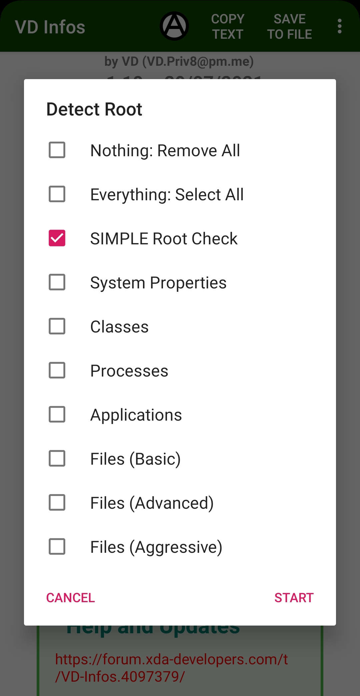

**English** | [Português](LEIAME.md)  
  
# VD-Infos  
XDA Thread: https://xdaforums.com/t/app-vd-infos-package-com-vitaodoidao-vdinfos.4097379/  
  
   
  
As we all know, Android is a super powerful and super versatile operating system.  
What nobody tells you is that all your personal details and confidential information are available for all your installed applications.  
Protect yourself against these types of invasions of privacy is an obligation.  
The VD Infos app reads several of these details and information to show you an example of what can be captured from your device in use.  
**NO ONE INFORMATION IS STORED, SENT OR TRANSMITTED TO ANY FILE OR SERVER.**  
If you want, you can disallow usage of internet with a firewall, or you can just turn off the internet.  
  
  
  
## **Why use this?**  
* **Just for curious.**  
* **See your device informations.**  
* **Test your hooks and spoofs.**  
  
## **Languages:**  
* **English**  
* **Portuguese**  
  
## **What can this read?**  
* **ULTRA ROOT CHECKER/DETECTOR**.  
* **ULTRA MAGISK CHECKER/DETECTOR**.  
* **ULTRA XPOSED CHECKER/DETECTOR**.  
* **ULTRA RIRU CHECKER/DETECTOR**.  
* Simple Root Check (Fast and Quickly).  
* Check many ways to detect android emulators.  
* Check many ways to detect busybox, whale framework, taichi frameworks, xposedbridge, lsposed, edxposed, virtualxposed, vaexposed, exposed, quickxposed, sandvxposed, zhihuxposed, xhook, supersu, suhide, luckypatcher, deviceemulator, rootcloak, xprivacy, xprivacylua, ebxprivacy, titaniumbackup, deviceidmasker and others.  
* Read Bluetooth MAC and VISIBLE NAME.  
* Read bounded bluetooth devices.  
* Read radio/modem/baseband version.  
* Read the state of the BOOTLOADER.  
* Read device name.  
* Read phone infos: Market Name, Device, Brand, Model, Product, Display ID, Manufacturer, Hardware.  
* Read Android infos: Host, Type, Build Date and Android Version.  
* Read phone system: KERNEL, MEMORY, Security Patch and System Version.  
* Read encryption infos.  
* Read build keys.  
* Read REGION.  
* Read Advertising ID.  
* Detects currently Selinux configuration.  
* Read build properties.  
* Read Android ID.  
* Read GSF ID (Google Services Framework).  
* Read IMEI (of all SIMs).  
* Read FINGERPRINT.  
* Check many ways to read SERIAL number.  
* List ACCOUNTS.  
* List CALL LOGS.  
* Read User-Agent (http.agent and getUserAgentString).  
* List SIM informations (of all SIMs).  
* List PHONE informations.  
* List WIFI informations (like MAC, IP, NAME, DNS, DHCP and previously connected WIFIs).  
* List NETWORK informations (each one).  
* List RUNNING PROCESSES.  
* List RUNNING SERVICES.  
* List INSTALLED PACKAGES.  
* List INSTALLED APPLICATIONS.  
  
## **How to protect yourself ?**  
* **Blank's Integrity Guide:** A guide to how to hide root and pass Strong Integrity.  
https://t.me/BlankAssistance/7/2437  
https://t.me/BlankAssistance  
https://t.me/BlankAssistance_Integrity  
* **Magisk:** A suite of open source software for customizing Android, supporting devices higher than Android 6.0.  
https://github.com/topjohnwu/Magisk  
https://xdaforums.com/t/magisk-the-magic-mask-for-android.3473445/  
* **Magisk Alpha:** A fork of Magisk.  
https://t.me/magiskalpha  
* **Kitsune Mask (Magisk Delta):** A fork of Magisk.  
https://github.com/KitsuneMagisk/Magisk  
https://github.com/HuskyDG/magisk-files  
https://xdaforums.com/t/discussion-kitsune-mask-another-unofficial-mask-of-magisk.4460555/  
* **APatch:** The patching of Android kernel and Android system.  
https://github.com/bmax121/APatch  
https://xdaforums.com/t/dev-apatch-an-alternative-root-solution-to-kernelsu-and-magisk.4655727/  
* **KernelSU:** A Kernel-based root solution for Android devices.  
https://github.com/tiann/KernelSU  
* **LSPosed:** Successor of Xposed Framework.  
https://xdaforums.com/t/lsposed-xposed-framework-8-1-13-0-simple-magisk-module.4228973/  
https://github.com/LSPosed/LSPosed  
https://t.me/LSPosed  
https://t.me/LSPosedDiscussion  
https://t.me/LSPosedArchives  
https://t.me/lsposed_log  
* **LSPosed Internal:** A fork of LSPosed by its own developers.  
https://t.me/+VoX7SSzR6UUyN2I1  
* **LSPosed Irena:** A fork of LSPosed.  
https://github.com/re-zero001/LSPosed-Irena  
* **LSPosed NPM:** A fork of LSPosed.  
https://t.me/rormzhstjxm  
* **LSPosed by JingMatrix:** A fork of LSPosed.  
https://github.com/JingMatrix/LSPosed  
* **LSPosed_mod by mywalkb:** A fork of LSPosed.  
https://github.com/mywalkb/LSPosed_mod  
* **LSPosed by CMDQ8575:** A fork of LSPosed.  
https://github.com/CMDQ8575/LSPosed  
* **XPL-EX (XPrivacyLua Extended):** A fork of XPrivacyLua.  
https://xdaforums.com/t/xpl-ex-xprivacylua-ex-android-privacy-manager-hooking-manager-extended.4652573/  
https://github.com/0bbedCode/XPL-EX  
https://t.me/XPL_EX  
https://t.me/XPL_EX_CHAT  
* **XPL-EX Pro (XPrivacyLua Extended Pro):** A fork of XPrivacyLuaPro.  
https://github.com/0bbedCode/XPL-EX/releases  
* **WeiJu2:** The first scriptable xposed module, provides a new way to change the application behavior. Powered by Lua and made with ♥  
https://xdaforums.com/t/app-xposed-7-0-weiju2-scriptable-xposed-module.4482585/  
https://github.com/ikws4/WeiJu2  
* **Shamiko:** A Zygisk module to hide Magisk root, Zygisk itself and Zygisk modules.  
https://github.com/LSPosed/LSPosed.github.io/releases  
* **Zygisk-Assistant:** A Zygisk module to hide root for KernelSU, Magisk and APatch, designed to work on Android 5.0 and above.  
https://github.com/snake-4/Zygisk-Assistant  
https://xdaforums.com/t/module-zygisk-assistant-foss-root-hider.4664761/  
* **Cherish Peekaboo:** Some kind of alternative to Shamiko for APatch.  
https://t.me/app_process64  
* **Sensitive Props mod:** Reset sensitive properties to safe state.  
https://www.pling.com/p/2129780  
https://github.com/Pixel-Props/sensitive-props  
https://t.me/PixelProps  
https://t.me/pixelpropschat  
* **Zygisk-maphide:** Wipe out the traces of mounted files of Magisk module for process on DenyList.  
https://github.com/HuskyDG/zygisk-maphide  
* **ZygiskNext:** Standalone implementation of Zygisk, providing Zygisk API support for KernelSU and a replacement of Magisk's built-in Zygisk.  
https://github.com/Dr-TSNG/ZygiskNext  
https://t.me/real5ec1cff  
https://t.me/nullptr_dev  
* **Zygisk_mod:** An open-source fork of Zygisk Next.  
https://github.com/Admirepowered/Zygisk_mod  
* **ReZygisk:** A fork of Zygisk Next, which is a standalone implementation of Zygisk, providing Zygisk API support for KernelSU, Magisk (besides built-in) and APatch (work in progress).  
https://github.com/PerformanC/ReZygisk  
* **Tricky Store:** A trick of keystore.  
https://github.com/5ec1cff/TrickyStore  
https://xdaforums.com/t/tricky-store-the-next-generation-pif.4683446/  
https://t.me/real5ec1cff  
https://t.me/nullptr_dev  
* **TrickyStore by N-X-T:** A fork of TrickyStore.  
https://github.com/N-X-T/TrickyStore  
* **TrickyStore by tryigit:** A fork of TrickyStore.  
https://github.com/tryigit/TrickyStore  
* **Zygisk-KeystoreInjection:** Generate a valid certificate chain from scratch by injecting custom Keystore provider.  
https://github.com/aviraxp/Zygisk-KeystoreInjection  
* **PlayIntegrityFix:** The module tries to fix Play Integrity and SafetyNet verdicts to get a valid attestation.  
https://github.com/chiteroman/PlayIntegrityFix  
https://xdaforums.com/t/module-play-integrity-fix-safetynet-fix.4607985/  
https://t.me/playintegrityfix  
https://t.me/playintegrityfixchat  
* **PlayIntegrityFork:** A fork of PlayIntegrityFix, to be more futureproof and develop more methodically.  
https://github.com/osm0sis/PlayIntegrityFork  
* **PlayIntegrityFix by tryigit:** A fork of PlayIntegrityFix.  
https://github.com/tryigit/PlayIntegrityFix  
* **PlayIntegrityNEXT:** A module that downloads a working fingerprint instead of making a fork every time. The module is called 'playcurl,' and you simply need to install it alongside the official PlayIntegrityFix.  
https://github.com/daboynb/PlayIntegrityNEXT  
* **AutoPIF Next - PlayIntegrity Fix Next Fork:** Automatically download working pif.json online from the repository and bypass Google Play Integrity Check.  
https://xdaforums.com/t/module-autopif-next-play-integrity-fix-fork-safetynet-fix.4652252/  
https://github.com/x1337cn/AutoPIF-Next  
* **playcurlNEXT:** Fingerprint downloader for play integrity fix.  
https://github.com/daboynb/playcurlNEXT  
* **Framework Patch:** Modify framework.jar to build on system level a valid certificate chain   
https://github.com/chiteroman/FrameworkPatch  
* **Framework Patcher GO:** A Magisk/KernelSU/APatch module to modify framework.jar directly on the phone, to build a valid system-level certificate chain.  
https://github.com/changhuapeng/FrameworkPatcherGO  
https://xdaforums.com/t/module-framework-patcher-go.4674536/  
* **Hide My AppList:** An Xposed module to hide apps or reject app list requests.  
https://github.com/Dr-TSNG/Hide-My-Applist  
* **HMAL:** A fork of Hide My AppList.  
https://github.com/pumPCin/HMAL  
* **Geergit:** A Module to Protect Your Privacy.  
https://xdaforums.com/t/app-xposed-5-0-13-geergit-a-module-to-protect-your-privacy.4573243/  
https://github.com/pyshivam/geergit-discussion  
https://github.com/Xposed-Modules-Repo/com.pyshivam.geergit  
https://t.me/geergit_xposed  
* **Android Faker:** A Module For Spoofing Your Device.  
https://xdaforums.com/t/app-xposed-8-1-13-android-faker-a-module-for-spoof-your-device.4284233  
https://github.com/Android1500/AndroidFaker  
https://github.com/Xposed-Modules-Repo/com.android1500.androidfaker  
https://t.me/androidfakerofficial  
* **Device ID Masker:** Spoof your vital private information from Third Party As Well As System Apps.  
https://bytesreverserapps.com/device-id-masker/  
* **I am not a developer:** Hide development mode, USB debugging mode and wireless debugging mode.  
https://github.com/xfqwdsj/IAmNotADeveloper  
https://github.com/Xposed-Modules-Repo/xyz.xfqlittlefan.notdeveloper  
* **E-Government Liberator (formerly Digitales Amt Liberator):** E-Government Liberator removes any calls in supported Austrian e-government apps to root and bootloader checks and therefore provides a tailored solution to running the app on rooted devices.  
https://github.com/Crazyphil/digitales-amt-liberator  
* **BootloaderSpoofer:** Spoof locked bootloader on local attestations.  
https://github.com/chiteroman/BootloaderSpoofer  
https://xdaforums.com/t/spoof-locked-bootloader-bypass-tee-check.4586251/  
* **Wa Revamp:** An Xposed Module to customize and enable privacy on WhatsApp.  
https://github.com/ItsMadruga/WaRevamp  
https://t.me/warevampmodule  
* **Wa Enhancer:** An Xposed Module to customize and enable privacy on WhatsApp.  
https://t.me/waenhancer  
https://t.me/waenhancher  
https://github.com/Dev4Mod/WaEnhancer  
* **AdClose:** An Xposed module to prevent in-app advertising SDK initialization. Block the app's online ad requests. Allow screenshots and screen recordings to be taken freely in the app. Remove in-app VPN and system proxy detection. Used to disable sensor-based advertising jumps such as Shake. Removes general Root, Magisk and Xposed framework detection within the app.  
https://github.com/Xposed-Modules-Repo/com.close.hook.ads  
https://github.com/zjyzip/AdClose  
* **NoVPNDetect:** An Xposed module prevent some apps detect your phone connected to VPN.  
https://github.com/Xposed-Modules-Repo/me.hoshino.novpndetect  
https://bitbucket.org/yuri-project/novpndetect  
* **NeoBackup:** A modern backup manager for Android.  
https://github.com/NeoApplications/Neo-Backup  
https://t.me/neo_backup  
https://xdaforums.com/t/app-8-0-open-source-root-neo-backup-apps-and-data-backup-tool-for-android.4167179/  
* (Deprecated) **XPrivacyLua:** Successor of XPrivacy. Revoking Android permissions from apps often let apps crash or malfunction. XPrivacyLua solves this by feeding apps fake data instead of real data.  
https://xdaforums.com/t/discussion-lsposed-unofficial-xprivacylua-android-privacy-manager.4533999/  
https://xdaforums.com/t/closed-app-xposed-6-0-xprivacylua-android-privacy-manager-unsupported.3730663/  
https://github.com/Xposed-Modules-Repo/eu.faircode.xlua  
* (Deprecated) **XPrivacyLuaPro:** Pro companion app for XPrivacyLua.  
https://xdaforums.com/t/closed-app-xposed-6-0-xprivacylua-pro-companion-app.3743040/  
https://bitbucket.org/M66B/xlua-companion/downloads/  
* (Deprecated) **Magisk Hide:** Natively blocks root usage and detection.  
https://xdaforums.com/apps/magisk/official-magisk-v7-universal-systemless-t3473445  
https://github.com/topjohnwu/Magisk  
* (Deprecated) **Riru - Enhanced mode for Magisk Hide:** Enable Enhanced mode for Magisk Hide. Allow Magisk Hide to handle isolated processes.  
https://github.com/vvb2060/riru-unshare  
* (Deprecated) **Riru - Momo Hider:** This module tries to make "Magisk Hide" more hidden.  
https://github.com/canyie/Riru-MomoHider  
* (Deprecated) **Universal SafetyNet Fix:** Magisk module to work around Google's SafetyNet and Play Integrity attestation.  
https://xdaforums.com/t/magisk-module-universal-safetynet-fix-2-4-0.4217823/  
https://github.com/kdrag0n/safetynet-fix  
* (Deprecated) **RootCloak2:** Blocks the use and detection of root and also blocks the use of other commands that can be customized.  
https://xdaforums.com/t/mod-xposed-4-0-rootcloak-completely-hide-root-from-specific-apps-2014-01-14.2574647/  
https://mattj.io/rootcloak/  
https://github.com/devadvance/rootcloak  
* (Deprecated) **Device Emulator:** Xposed module for changing (MASKING) the various IDs in the phone.  
https://deviceemulator.github.io/app  
* (Deprecated) **XPrivacy:** Prevent applications from leaking privacy-sensitive data by restricting the categories of data an application can access. XPrivacy feeds applications fake data or no data at all.  
https://xdaforums.com/t/closed-xprivacy-the-ultimate-yet-easy-to-use-privacy-manager.2320783/  
https://github.com/M66B/XPrivacy  
* (Deprecated) **Xposed:** Xposed is a framework that allows developers to apply modules to the Read-Only Memory (ROM) of Android for the purpose of modifying the app's behavior or creating a modified app.  
https://xdaforums.com/t/official-xposed-for-lollipop-marshmallow-nougat-oreo-v90-beta3-2018-01-29.3034811/  
https://xdaforums.com/t/xposed-general-info-versions-changelog.2714053/  
https://github.com/rovo89?tab=repositories&q=xposed  
* (Deprecated) **Mdg Wa:** An Xposed Module to customize and enable privacy on WhatsApp.  
https://github.com/ItsMadruga/MdgWa  
  
## **Based on:**  
* **RootBeer Sample:** https://github.com/scottyab/rootbeer  
* **RootbeerFresh:** https://github.com/kimchangyoun/rootbeerFresh  
* **Native Root Checker:** https://github.com/DimaKoz/meat-grinder  
* **PiracyChecker** https://github.com/javiersantos/PiracyChecker  
* **Cordova Jailbreak/Root Detection Plugin** https://github.com/WuglyakBolgoink/cordova-plugin-iroot  
  
## **Tested on:**  
* **Android 4.4.2:** SDK 19  
* **Android 4.4.4:** SDK 19  
* **Android 5.0.2:** SDK 21  
* **Android 5.1.1:** SDK 22  
* **Android 6.0:** SDK 23  
* **Android 7.0:** SDK 24  
* **Android 7.1.1:** SDK 25  
* **Android 7.1.2:** SDK 25  
* **Android 8.0.0:** SDK 26  
* **Android 8.1.0:** SDK 27  
* **Android 9.0:** SDK 28  
* **Android 10.0:** SDK 29  
* **Android 11.0:** SDK 30  
* **Android 12.0:** SDK 31  
  
## **How to detect root ?**  
Use native detectors. Like:  
  
* **Holmes:** https://t.me/app_process64  
* **Native Test:** https://t.me/nullptr_dev  
* **Native Detector:** https://t.me/rootdetector  
* **Hunter:** https://t.me/Zhenxi233  
* **Momo:** https://t.me/magiskalpha  
* **Securify:** https://github.com/RabehX/Securify/releases  
* **Memory Detector:** https://github.com/reveny/detection/blob/main/MemoryDetector_2.1.0.apk  
* **Env Checks:** https://play.google.com/store/apps/details?id=com.dexprotector.detector.envchecks  
  
## **Contacts:**  
* **Skype:** VD.Priv8  
* **Telegram:** VD_Priv8  
* **E-mail:** vd.priv8 @ pm.me  
* **XDA-Developers:** VD171 https://xdaforums.com/m/vd171.4699873/  
  
## **Disclaimer:**  
* Use and distribute as you want and as you wish.  
  
## **Thanks to:**  
* **AkaBlank517:** https://t.me/AkaBlank517  
* **rovo89:** https://xdaforums.com/m/rovo89.4419114/  
* **rovo89:** https://github.com/rovo89  
* **re-zero001:** https://github.com/re-zero001  
* **pumPCin:** https://github.com/pumPCin  
* **mywalkb:** https://github.com/mywalkb  
* **CMDQ8575:** https://github.com/CMDQ8575  
* **ObbedCode:** https://xdaforums.com/m/obbedcode.12793605/  
* **ObbedCode:** https://github.com/0bbedCode  
* **zhipingne:** https://xdaforums.com/m/zhipingne.9027367/  
* **ikws4:** https://github.com/ikws4  
* **M66B:** https://xdaforums.com/m/m66b.2799345/  
* **M66B:** https://github.com/M66B  
* **Fif_:** https://xdaforums.com/m/fif_.5297163/  
* **Fif_:** https://github.com/F-i-f  
* **AndroidX:** https://xdaforums.com/m/androidx.7762470/  
* **AndroidX:** https://github.com/Android1500  
* **Unique Solution:** https://deviceemulator.github.io/app  
* **BytesReverser:** https://xdaforums.com/m/bytesreverser.8062804/  
* **pyshivam:** https://xdaforums.com/m/pyshivam.9833141/  
* **pyshivam:** https://github.com/pyshivam  
* **scottyab:** https://xdaforums.com/m/scottyab.2530687/  
* **scottyab:** https://github.com/scottyab  
* **topjohnwu:** https://xdaforums.com/m/topjohnwu.4470081/  
* **topjohnwu:** https://github.com/topjohnwu  
* **devadvance:** https://xdaforums.com/m/devadvance.2804938/  
* **devadvance:** https://github.com/devadvance  
* **hikaritenchi:** https://xdaforums.com/m/hikaritenchi.3514987/  
* **hikaritenchi:** https://github.com/hikaritenchi  
* **DimaKoz** https://github.com/DimaKoz  
* **kimchangyoun** https://github.com/KimChangYoun  
* **javiersantos** https://github.com/javiersantos  
* **WuglyakBolgoink** https://github.com/WuglyakBolgoink  
* **vvb2060:** https://github.com/vvb2060  
* **canyie:** https://github.com/canyie  
* **yujincheng08:** https://github.com/yujincheng08  
* **Dr-TSNG:** https://github.com/Dr-TSNG  
* **5ec1cff:** https://github.com/5ec1cff  
* **Admirepowered:** https://github.com/Admirepowered  
* **aviraxp:** https://github.com/aviraxp  
* **bmax121:** https://github.com/bmax121  
* **changhuapeng:** https://github.com/changhuapeng  
* **changhuapeng:** https://xdaforums.com/m/changhuapeng.12770876/  
* **chiteroman:** https://github.com/chiteroman  
* **chiteroman:** https://xdaforums.com/m/chiteroman.10277887/  
* **Crazyphil:** https://github.com/Crazyphil  
* **daboynb:** https://github.com/daboynb  
* **HuskyDG:** https://github.com/HuskyDG  
* **HuskyDG:** https://xdaforums.com/m/huskydg.11455139/  
* **JingMatrix:** https://github.com/JingMatrix  
* **kdrag0n:** https://github.com/kdrag0n  
* **kdrag0n:** https://xdaforums.com/m/kdrag0n.7291478/  
* **osm0sis:** https://github.com/osm0sis  
* **osm0sis:** https://xdaforums.com/m/osm0sis.4544860/  
* **PerformanC:** https://github.com/PerformanC  
* **snake-4:** https://github.com/snake-4  
* **snake-4:** https://xdaforums.com/m/snake-4.12839217/  
* **tiann:** https://github.com/tiann  
* **tomyan112:** https://xdaforums.com/m/tomyan112.5993032/  
* **x1337cn:** https://github.com/x1337cn  
* **x1337cn:** https://xdaforums.com/m/x1337cn.10497543/  
* **N-X-T:** https://github.com/N-X-T  
* **tryigit:** https://github.com/tryigit  
* **xfqwdsj:** https://github.com/xfqwdsj  
* **RabehX:** https://github.com/RabehX  
* **Reveny:** https://github.com/Reveny  
* **Dev4Mod:** https://github.com/Dev4Mod  
* **ItsMadruga:** https://github.com/ItsMadruga  
* **zjyzip:** https://github.com/zjyzip  
  
## **Download and support:**  
* https://github.com/VD171/VD-Infos  
* https://xdaforums.com/t/VD-Infos.4097379/  
* Mirror: https://priv8.in/VD_Infos.apk  
* Mirror: https://priv8.ru/VD_Infos.apk  
