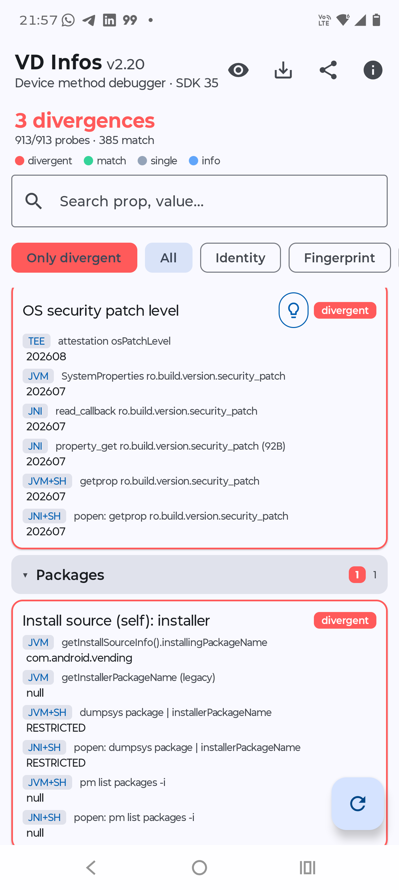
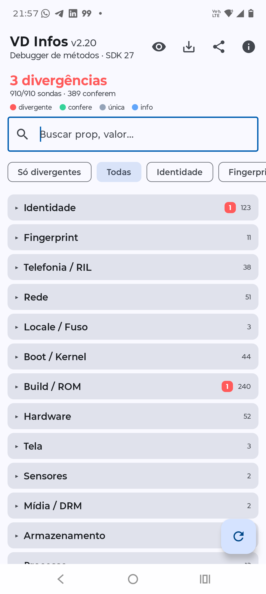

**English** | [Português](README.pt.md) | [Español](README.es.md) | [Italiano](README.it.md) | [Deutsch](README.de.md) | [Français](README.fr.md) | [Русский](README.ru.md) | [Bahasa Indonesia](README.id.md) | [Türkçe](README.tr.md) | [Polski](README.pl.md) | [Nederlands](README.nl.md) | [Svenska](README.sv.md) | [Čeština](README.cs.md) | [Tiếng Việt](README.vi.md) | [中文](README.zh.md) | [日本語](README.ja.md) | [한국어](README.ko.md) | [فارسی](README.fa.md) | [हिन्दी](README.hi.md) | [العربية](README.ar.md) | [ไทย](README.th.md)

# VD Infos

*Device method debugger*

[](LICENSE)
[](https://github.com/VD171/VD-Infos/releases)
[](https://github.com/VD171/VD-Infos/releases)
[](https://github.com/VD171/VD-Infos/releases)
[](README.md)

 

Android is a super powerful and versatile operating system; what nobody tells you
is that all your personal details and confidential information are available to
every application you install, and protecting yourself against these invasions of
privacy is an obligation. VD Infos shows you an example of what can be captured from
your device, and it does so as a *method debugger*: for each piece of information it
reads the value through **every method that can read it** - `Build.*`,
`SystemProperties`, `getprop`, the native `__system_property_get`, system managers,
content providers, files, syscalls, and hardware key attestation (TEE) - and lines
them up so you can compare. When one method disagrees with the others, something in
between is rewriting that surface: a hooking framework, a spoofer, a resolver shim.
**NO INFORMATION IS STORED, SENT OR TRANSMITTED TO ANY FILE OR SERVER** - everything
runs on-device, identity-bearing values are masked until you reveal them, and a
report only leaves the device when you explicitly share or save it; if you want,
block internet access with a firewall or just turn it off.

## What it inspects

Each item is read through every method that can read it (Java SDK / native / shell),
compared side by side:

* **~488 system properties** read FIVE ways: `SystemProperties.get`, both of
  bionic's entry points (`__system_property_read_callback` and the 92-byte
  `__system_property_get`), `getprop` spawned by the JVM, and `getprop` spawned
  from native code through `popen` - a shell command run by `ProcessBuilder` and
  the same command run without the JVM are not the same vantage point, because
  the first is a surface a root-hiding framework rewrites and the second is not.
* **Device identity**: model, manufacturer, brand, device, product, board, hardware,
  fingerprint, bootloader, build id/tags/type - each `Build.*` field against all its
  `ro.product.*` (system/vendor/odm) variants, native, and shell.
* **Identifiers**: serial (many getters), Android ID (settings and provider), GSF
  ID, advertising ID, IMEI/primary IMEI/MEID/IMSI/ICCID, user serial.
* **Telephony**: the TelephonyManager surface (operator, SIM, network, roaming...),
  SubscriptionManager (multi-SIM), cell info.
* **Network**: per-interface **MAC** (`NetworkInterface` vs `/sys/class/net` vs
  shell), Wi-Fi (SSID/BSSID/IP/MAC), Bluetooth, DNS.
* **Kernel / process / system**: `uname`, boot id, uptime, UID/PID, SELinux,
  timezone, locale, environment, running services/processes.
* **Hardware / media**: CPU, memory, sensors, display, cameras, system features,
  GPU, Widevine DRM ID.
* **Packages / accounts / WebView**: installed package list and count, per-app
  signing digests, this-app signature, self-package introspection, intent-resolution enumerations, accounts, call-log count, user agent.
* **Sandbox conformance**: surfaces the sandbox is meant to CLOSE (eMMC CID/serial,
  UFS and SoC identity, `/proc/cmdline`, `/proc/1/*`, `/dev/kmsg`,
  `/system/build.prop`) and 22 `dumpsys` services. Here the refusal is the answer:
  `EACCES`/`DENIED` is the conformant reading, and a device that hands the content
  over instead is out of conformance.
* **Advertising identifiers**: the GAID from the Play Services binder, plus the whole
  key family (AAID, OAID/VAID and Huawei's `pps_*`) swept across the three settings
  stores.
* **Root / hook / emulator detectors**: `su`/Magisk/KernelSU/APatch/Xposed/LSPosed/
  Riru artifacts, injected libs in `/proc/self/maps`, known packages, dangerous and
  emulator properties, verified boot state.

## Download and support

Each release publishes two APKs: **SDK_35** targets the strict modern sandbox and is the one to use; **SDK_27** targets an older API level, with a looser SELinux domain, useful for comparison. Both install on Android 8.0 and newer.

* Release (APK): https://github.com/VD171/VD-Infos/releases
* https://github.com/VD171/VD-Infos
* https://xdaforums.com/t/VD-Infos.4097379/
* https://t.me/RootDetected
* https://t.me/BlankAssistance

## Languages

21 UI languages: English, Portuguese, Spanish, Italian, German, French, Russian,
Indonesian, Turkish, Polish, Dutch, Swedish, Czech, Vietnamese, Chinese, Japanese,
Korean, Persian, Hindi, Arabic and Thai. The app offers a one-time language chooser on
first launch (with a "System default" option) and follows the system language otherwise.

## Architecture

```
core/model      immutable domain: Lens, Category, Verdict, ProbeSpec, ProbeResult
probe/          NativeBridge (JNI) - SystemProps (reflection) - PropCatalog (data)
                SemanticProbes - IntegrityProbes - ProbeRegistry
engine/         ProbeEngine - coroutine fan-out, streams results as a Flow
data/           SnapshotStore (persist + diff) - Exporter (JSON/text share)
ui/             Jetpack Compose, Material 3, dynamic colour, live progress
cpp/            native_probes.cpp - the native lens, dependency-free
```

* **Parallelism**: 885 probes fan out across the default dispatcher with a bounded
  permit count; results stream into the UI as they land.
* **Nothing in the background**: no services and no scheduled scans; the app runs only
  while it is open and closes itself when left idle.
* **Native layer**: one small `.so`, bound by name via `RegisterNatives`, kept
  deliberately tiny because it is the part that must be hard to fool.

## Contributing

Most contributions need no Kotlin: the lists live as plain text under `VDInfos/app/src/main/assets/data/`. Add or remove one line and open a pull request.

* `*_apps.txt` - one package name per line
* `props.txt` - the system-property catalog, `CATEGORY<tab>key`
* `spoof_keys.txt` - the settings-spoof matrix, `key:TYPE`
* other `.txt` files - one entry per line too (kernel-module name fragments, `/data/local/tmp` file names)

A `#` starts a comment; blank lines are ignored. Code contributions are welcome too. By contributing you agree your work ships under this project's AGPL-3.0-or-later.

## Catalog

Root hiding and detection references (guides, modules, frameworks, detectors) live
in a dedicated catalog: [CATALOG.md](CATALOG.md).

## Acknowledgements

Special thanks to **[frknkrc44](https://github.com/frknkrc44)**, developer of
**[HMA-OSS](https://github.com/frknkrc44/HMA-OSS)**, for the care put into it.
HMA-OSS is where several of the fixes this app suggests are
applied - hiding target apps and setting spoof presets - and every in-app mention of it
links back to its source.

Its links, channels and how to support it: [HMA-OSS.md](HMA-OSS.md).

## Contacts

* https://vd171.ru
* https://vd.priv8.ru
* **Telegram:** @VD_Priv8 https://t.me/VD_Priv8
* **Discord:** @VD.Priv8 https://discord.com/users/1296831918989639721
* **E-mail:** vd.priv8@pm.me
* **XDA-Developers:** @VD171 https://xdaforums.com/m/vd171.4699873/
* **GitHub:** @VD171 https://github.com/VD171

## License

**GNU AGPL-3.0-or-later** - see [LICENSE](LICENSE). Copyleft, including the network
clause: anyone who runs a modified version (even as a service) must offer its
source. Chosen deliberately for a research/anti-detection tool, to keep forks open.

---

`android` `privacy` `security` `root-detection` `hook-detection` `spoof-detection` `anti-detection` `tamper-detection` `device-fingerprint` `magisk` `kernelsu` `lsposed` `play-integrity` `attestation` `tee` `keystore` `scanner` `diagnostics` `reverse-engineering` `kotlin`
