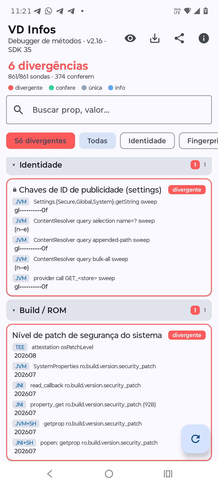
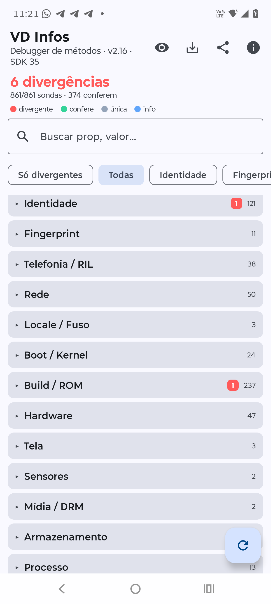

**English** | [Português](README.pt-BR.md)

# VD Infos

XDA Thread: https://xdaforums.com/t/app-vd-infos-package-com-vitaodoidao-vdinfos.4097379/

 

Android is a super powerful and versatile operating system; what nobody tells you
is that all your personal details and confidential information are available to
every application you install, and protecting yourself against these invasions of
privacy is an obligation. VD Infos shows you an example of what can be captured from
your device, and it does so as a *method debugger*: for each piece of information it
reads the value through **every method that can read it** - `Build.*`,
`SystemProperties`, `getprop`, the native `__system_property_get`, system managers,
content providers, files, syscalls, and hardware key attestation (TEE) - and lines
them up so you can compare. When one method disagrees with the others, something in
between is rewriting that surface: a hooking framework, a spoofer, a resolver shim.
**NO INFORMATION IS STORED, SENT OR TRANSMITTED TO ANY FILE OR SERVER** - everything
runs on-device, identity-bearing values are masked until you reveal them, and a
report only leaves the device when you explicitly share or save it; if you want,
block internet access with a firewall or just turn it off.

## What it inspects

Each item is read through every method that can read it (Java SDK / native / shell),
compared side by side:

* **~360 system properties** read three ways: `SystemProperties.get`,
  `__system_property_get`, and `getprop`.
* **Device identity**: model, manufacturer, brand, device, product, board, hardware,
  fingerprint, bootloader, build id/tags/type - each `Build.*` field against all its
  `ro.product.*` (system/vendor/odm) variants, native, and shell.
* **Identifiers**: serial (many getters), Android ID (settings and provider), GSF
  ID, advertising ID, IMEI/primary IMEI/MEID/IMSI/ICCID, user serial.
* **Telephony**: the TelephonyManager surface (operator, SIM, network, roaming...),
  SubscriptionManager (multi-SIM), cell info.
* **Network**: per-interface **MAC** (`NetworkInterface` vs `/sys/class/net` vs
  shell), Wi-Fi (SSID/BSSID/IP/MAC), Bluetooth, DNS.
* **Kernel / process / system**: `uname`, boot id, uptime, UID/PID, SELinux,
  timezone, locale, environment, running services/processes.
* **Hardware / media**: CPU, memory, sensors, display, cameras, system features,
  GPU, Widevine DRM ID.
* **Packages / accounts / WebView**: installed package list and count, per-app
  signing digests, this-app signature, self-package introspection, intent-resolution enumerations, accounts, call-log count, user agent.
* **Root / hook / emulator detectors**: `su`/Magisk/KernelSU/APatch/Xposed/LSPosed/
  Riru artifacts, injected libs in `/proc/self/maps`, known packages, dangerous and
  emulator properties, verified boot state.

## Languages

Brazilian Portuguese and English.

## Catalog

Root hiding and detection references (guides, modules, frameworks, detectors) live
in a dedicated catalog: [CATALOG.md](CATALOG.md).

## Architecture

```
core/model      immutable domain: Lens, Category, Verdict, ProbeSpec, ProbeResult
probe/          NativeBridge (JNI) - SystemProps (reflection) - PropCatalog (data)
                SemanticProbes - IntegrityProbes - ProbeRegistry
engine/         ProbeEngine - coroutine fan-out, streams results as a Flow
data/           SnapshotStore (persist + diff) - Exporter (JSON/text share)
work/           SnapshotWorker - periodic background scan + drift notification
ui/             Jetpack Compose, Material 3, dynamic colour, live progress
cpp/            native_probes.cpp - the native lens, dependency-free
```

* **Parallelism**: ~540 probes fan out across the default dispatcher with a bounded
  permit count; results stream into the UI as they land.
* **Background action**: a WorkManager job re-scans on a schedule, diffs against the
  last capture, and notifies when any value drifts.
* **Native layer**: one small `.so`, bound by name via `RegisterNatives`, kept
  deliberately tiny because it is the part that must be hard to fool.

## Contacts

* **Telegram:** VD_Priv8 https://t.me/VD_Priv8
* **E-mail:** vd.priv8 @ pm.me
* **XDA-Developers:** VD171 https://xdaforums.com/m/vd171.4699873/
* **GitHub:** VD171 https://github.com/VD171

## Download and support

* https://github.com/VD171/VD-Infos
* https://xdaforums.com/t/VD-Infos.4097379/
* https://t.me/RootDetected
* https://t.me/BlankAssistance

## License

**GNU AGPL-3.0-or-later** - see [LICENSE](LICENSE). Copyleft, including the network
clause: anyone who runs a modified version (even as a service) must offer its
source. Chosen deliberately for a research/anti-detection tool, to keep forks open.
